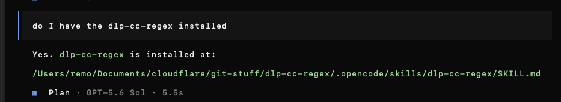
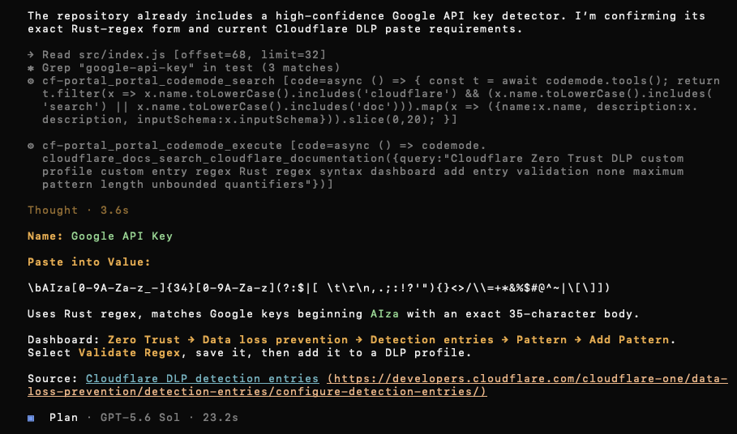

# dlp-cc-regex OpenCode skill

A reusable OpenCode skill for the Cloudflare DLP Regex Builder.

## For sales and customer demos

Sales users do not need a development environment. Open the live builder:

<https://dlp-regex.itlinux.cc/>

Demo flow:

1. Choose a provider preset, such as **AWS access key ID**, **Google API key**, or
   **Azure Storage SAS**.
2. Show the detection note and synthetic sample.
3. Paste customer-safe sample text; never paste a real credential.
4. Show the Rust-authoritative validation result and matches.
5. Copy the validated Rust regex when the customer is ready to implement.

The live demo requires no npm, Terraform, Docker, Cloudflare credentials, or login.

## Customer deployment prerequisites

The public demo and customer deployment are separate. To deploy a rule into a
customer's own Cloudflare environment, the customer needs:

- A Cloudflare account with Zero Trust/DLP enabled.
- Their Cloudflare account ID and target Zero Trust configuration.
- A customer-owned API token with **Account → Zero Trust → Edit** for DLP/Gateway
  configuration.
- **Account → Workers Scripts → Edit** only if they also deploy the Worker.
- Organizational approval for the intended traffic inspection and TLS/Gateway
  enforcement.

The customer must create and store the token in their own secret manager or
deployment environment. Never paste it into the public demo, this skill, or Git.

## OpenCode examples

OpenCode can discover the installed project skill directly:



### OpenCode detector investigation

Example OpenCode investigation of the Google API key detector and Cloudflare DLP
Rust-regex requirements:



## Screenshots

The live builder is available at <https://dlp-regex.itlinux.cc/>.


## Install the skill for OpenCode

Copy `.opencode/skills/dlp-cc-regex/` into the project root, or clone this repository and add its path to `opencode.json`:

```json
{
  "skills": ["/path/to/dlp-cc-regex-skill/.opencode/skills"]
}
```

OpenCode also discovers `.opencode/skills/<name>/SKILL.md` when this repository is used as the project directory.

## Use locally

Install this skill in OpenCode. It provides the project guidance automatically;
users do not need to install npm, Terraform, Docker, or Cloudflare credentials just
to load the skill.

For the runnable DLP Builder, use the public demo or the application repository's
own local-development instructions. This skill repository contains guidance only,
not the Worker runtime or its dependencies.

## Contents

- `SKILL.md` — Rust/WASM-authoritative DLP regex, security, testing, UI, Terraform, and deployment guidance.

Repository: https://github.com/remocloudflare/dlp-cc-regex-skill
